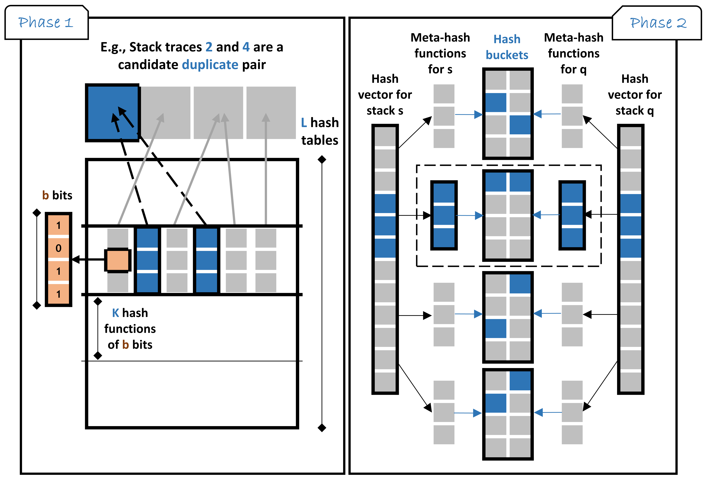

# DeepLSH: Deep Locality-Sensitive Hash Learning for Fast and Efficient Near-Duplicate Crash Report Detection

## Overview

Automatic crash bucketing is a critical step in the software development process to efficiently analyze and triage bug reports. **DeepLSH** detects near-duplicate crash reports (stack traces likely caused by the same bug) in a large historical database using any similarity measure.

The approach trains a deep Siamese neural network to produce binary hash codes that preserve the locality-sensitive property, enabling fast approximate nearest-neighbor search via LSH hash tables.

This repository has been extended with an **LLM-enhanced similarity layer** (`llm_similarity.py`) that calls the DeepSeek API to semantically re-score any pair of stack traces, optionally incorporating the DeepLSH model's learned hamming score as an additional signal.



---

## Supported Similarity Measures

| Measure | Reference |
|---|---|
| Jaccard coefficient | [Wikipedia](https://en.wikipedia.org/wiki/Jaccard_index) |
| Cosine similarity | [Wikipedia](https://en.wikipedia.org/wiki/Sine_and_cosine) |
| Lucene TF-IDF | [Lucene docs](https://lucene.apache.org/core/7_6_0/core/org/apache/lucene/search/similarities/TFIDFSimilarity.html) |
| Edit distance (Levenshtein) | [Wikipedia](https://en.wikipedia.org/wiki/Edit_distance) |
| Brodie et al. | [Paper](https://www.cs.drexel.edu/~spiros/teaching/CS576/papers/Brodie_ICAC05.pdf) |
| PDM-Rebucket | [Paper](https://www.researchgate.net/publication/254041628_ReBucket_A_method_for_clustering_duplicate_crash_reports_based_on_call_stack_similarity) |
| DURFEX | [Paper](https://users.encs.concordia.ca/~abdelw/papers/QRS17-Durfex.pdf) |
| Lerch and Mezini | [Paper](https://files.inria.fr/sachaproject/htdocs//lerch2013.pdf) |
| Moroo et al. | [Paper](http://ksiresearch.org/seke/seke17paper/seke17paper_135.pdf) |
| TraceSIM | [Paper](https://arxiv.org/pdf/2009.12590.pdf) |

---

## Architecture


**Pipeline (A → B → C):**

```
Stack Trace A ──┐
                ├─► Siamese CNN Encoder ─► Hash Vector ─► LSH Buckets ─► Candidate Pairs
Stack Trace B ──┘                              │
                                               ▼
                                    Hamming Similarity Score
                                               │
                                               ▼
                              ┌────────────────────────────────┐
                              │  DeepSeek LLM (deepseek-chat)  │
                              │  + Jaccard / PDM / TraceSIM    │
                              │  + DeepLSH hamming score       │
                              │  + Raw stack frame text        │
                              └────────────────────────────────┘
                                               │
                                               ▼
                                    adjusted_score  [0.0 – 1.0]
                                    confidence      high/medium/low
                                    reasoning       explanation
                                    key_differences list
```

---

## Setup

> Recommended: Python 3.9

### 1. Clone and create a virtual environment

```bash
# Windows PowerShell
py -3.9 -m venv .venv
.\.venv\Scripts\Activate.ps1
pip install -r .\code\requirements.txt
```

```bash
# Linux / macOS
python3.9 -m venv .venv
source .venv/bin/activate
pip install -r ./code/requirements.txt
```

### 2. (Optional) Set the DeepSeek API key as an environment variable

The key is already embedded in `llm_similarity.py` as a fallback. To override it:

```bash
# Windows PowerShell
$env:DEEPSEEK_API_KEY = "sk-bb8237ce78c44f6b8eeda16a0eea0892"

# Linux / macOS
export DEEPSEEK_API_KEY="sk-bb8237ce78c44f6b8eeda16a0eea0892"
```

---

## Usage

All commands below assume you are in the repository root (`deep-locality-sensitive-hashing-main/`) with the virtual environment activated.

---

### Step 1 — List available measures

Prints all similarity measure columns available in `data/similarity-measures-pairs.csv`.

```bash
python .\code\run.py list
```

---

### Step 2 — Lite mode: query a precomputed similarity score (fast, no training)

Reads directly from the precomputed pairs CSV. Requires `--n-stacks 1000` (the provided file covers exactly 1000 stacks).

```bash
# TraceSIM similarity between stack 0 and stack 10
python .\code\run.py lite --measure TraceSim --index-a 0 --index-b 10

# Jaccard
python .\code\run.py lite --measure Jaccard --index-a 0 --index-b 10

# Brodie
python .\code\run.py lite --measure Brodie --index-a 0 --index-b 10

# DURFEX
python .\code\run.py lite --measure DURFEX --index-a 0 --index-b 10

# TF-IDF
python .\code\run.py lite --measure TfIdf --index-a 0 --index-b 10
```

---

### Step 3 — Train DeepLSH and build LSH hash tables

Trains the Siamese CNN encoder for a chosen measure, then builds LSH hash tables.

**Quick smoke test (recommended first run — finishes in ~1 min):**

```bash
python .\code\run.py deeplsh --measure TraceSim --n 200 --epochs 1 --batch-size 128
```

**Full training runs:**

```bash
# TraceSIM (default hyperparameters: n=1000, epochs=20, batch=512, m=64, b=16)
python .\code\run.py deeplsh --measure TraceSim

# Jaccard
python .\code\run.py deeplsh --measure Jaccard

# Cosine
python .\code\run.py deeplsh --measure Cosine

# TF-IDF
python .\code\run.py deeplsh --measure TfIdf

# Levenshtein
python .\code\run.py deeplsh --measure Levensh

# PDM-Rebucket
python .\code\run.py deeplsh --measure PDM

# Brodie
python .\code\run.py deeplsh --measure Brodie

# DURFEX
python .\code\run.py deeplsh --measure DURFEX

# Lerch
python .\code\run.py deeplsh --measure Lerch

# Moroo
python .\code\run.py deeplsh --measure Moroo
```

**Outputs saved automatically:**

| Path | Contents |
|---|---|
| `code/Models/model-deep-lsh-<measure>.model` | Trained intermediate encoder (Keras SavedModel) |
| `code/Hash-Tables/hash_tables_deeplsh_<measure>.pkl` | LSH hash tables (pickle) |

---

### Step 4 — LLM-enhanced similarity via DeepSeek API

`llm_similarity.py` calls the DeepSeek API to semantically re-score a pair of stack traces.
It always computes three baseline scores (Jaccard, PDM, TraceSIM) and optionally adds the
DeepLSH model's learned hamming score before sending everything to the LLM.

#### Mode A — Baseline only (no DeepLSH model required)

Sends Jaccard + PDM + TraceSIM scores and the raw stack frames to DeepSeek.

```bash
# Compare stack 0 vs stack 1 (first 1000 stacks loaded)
python .\code\llm_similarity.py --index-a 0 --index-b 1

# Compare stack 0 vs stack 5, load only first 500 stacks
python .\code\llm_similarity.py --index-a 0 --index-b 5 --n 500
```

#### Mode B — With trained DeepLSH model (recommended for best results)

Adds the DeepLSH hamming similarity score to the prompt so the LLM can use the
neural model's structural signal alongside its own semantic reasoning.

```bash
# First train the model (if not done yet):
python .\code\run.py deeplsh --measure TraceSim

# Then run LLM similarity with the trained encoder:
python .\code\llm_similarity.py --index-a 0 --index-b 1 \
    --model-path code/Models/model-deep-lsh-TraceSim.model

# Different pair, different measure model:
python .\code\llm_similarity.py --index-a 3 --index-b 42 \
    --model-path code/Models/model-deep-lsh-Jaccard.model

# If you trained with a non-default block size (--b flag must match training):
python .\code\llm_similarity.py --index-a 0 --index-b 1 \
    --model-path code/Models/model-deep-lsh-TraceSim.model \
    --b 16
```

#### Example output

```json
{
  "adjusted_score": 0.87,
  "confidence": "high",
  "reasoning": "Both traces share the same top-level exception and identical call chain through com.example.service. Minor frame differences in lower stack suggest the same root cause with a slightly different execution path.",
  "key_differences": [
    "Stack B has 3 additional frames in the thread pool layer",
    "Method name refactored: processRequest -> handleRequest in Stack B"
  ],
  "baseline": {
    "jaccard": 0.6842,
    "pdm": 0.7103,
    "tracesim": 0.7891,
    "deeplsh_hamming": 0.8412
  }
}
```

---

### Step 5 — Compute similarity directly (no LLM, no training)

Uses only the traditional algorithms. Useful for quick local checks.

```bash
# TraceSIM
python .\code\run_local.py --measure tracesim --index-a 0 --index-b 1

# Jaccard
python .\code\run_local.py --measure jaccard --index-a 0 --index-b 1

# Cosine
python .\code\run_local.py --measure cosine --index-a 0 --index-b 1

# PDM
python .\code\run_local.py --measure pdm --index-a 0 --index-b 1

# Levenshtein
python .\code\run_local.py --measure levenshtein --index-a 0 --index-b 1
```

---

## File Structure

```
deep-locality-sensitive-hashing-main/
├── data/
│   ├── frequent_stack_traces.csv          # 1000 distinct stack traces
│   └── similarity-measures-pairs.csv      # Precomputed pairwise scores for all 10 measures
│
└── code/
    ├── run.py                             # Main CLI: list / lite / deeplsh subcommands
    ├── run_local.py                       # Direct similarity computation (no training)
    ├── train_deeplsh.py                   # DeepLSH training script
    ├── llm_similarity.py                  # LLM-enhanced similarity via DeepSeek API  ← NEW
    │
    ├── python-packages/
    │   ├── deep_hashing_models.py         # Siamese network, HamDist layer, training helpers
    │   ├── lsh_search.py                  # Hash table construction and LSH search
    │   └── similarities.py               # Jaccard, PDM, TraceSIM, Cosine, etc.
    │
    ├── Models/                            # Saved encoder models (created after training)
    ├── Hash-Tables/                       # Saved LSH hash tables (created after training)
    └── notebooks/                         # Original Jupyter experimental notebooks
```

---

## How `llm_similarity.py` Works

### Scoring pipeline

```
1. Load stack traces from frequent_stack_traces.csv
2. Compute IDF weights over the full corpus
3. Compute baseline scores:
       jaccard(A, B)
       pdm(A, B)
       traceSim(A, B, idf)
4. [Optional] Load trained DeepLSH encoder model
       Rebuild frame vocabulary from corpus
       Encode A → hash_vector_A  (CNN forward pass)
       Encode B → hash_vector_B
       Binarise vectors (sign function: >0 → +1, else → -1)
       deeplsh_hamming = hamming_diff(hash_vector_A, hash_vector_B)
5. Build prompt:
       Raw frames of A and B
       All scores from steps 3–4
6. Call deepseek-chat with response_format=json_object, temperature=0
7. Return adjusted_score + confidence + reasoning + key_differences + baseline
```

### Key functions

| Function | File | Description |
|---|---|---|
| `load_deeplsh_model(path)` | `llm_similarity.py` | Loads a Keras SavedModel without recompiling |
| `compute_deeplsh_score(model, A, B, df_frames, max_len, b)` | `llm_similarity.py` | Encodes two stacks and returns hamming similarity |
| `get_baseline_scores(A, B, idf, deeplsh_score)` | `llm_similarity.py` | Aggregates all numeric scores into one dict |
| `build_prompt(A, B, baseline)` | `llm_similarity.py` | Formats the user message sent to DeepSeek |
| `call_deepseek(prompt)` | `llm_similarity.py` | OpenAI-compatible API call, returns parsed JSON |
| `llm_adjusted_similarity(A, B, idf, deeplsh_score)` | `llm_similarity.py` | End-to-end: scores → prompt → LLM → result dict |

---

## Notes

- The `--b` flag in `llm_similarity.py` must match the `--b` value used during `train_deeplsh.py` (default: `16`).
- The frame vocabulary is rebuilt from the same CSV at inference time, so the data file must not change between training and inference.
- DeepSeek API calls require a valid API key and network access. The key is read from the `DEEPSEEK_API_KEY` environment variable, falling back to the value hardcoded in `llm_similarity.py`.
- Notebooks in `code/notebooks/` reflect the original experimental setup and do not include the LLM layer.
